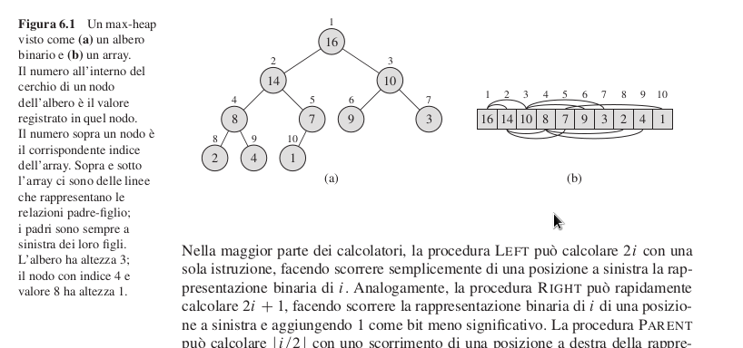

### MinHeap
Dato un insieme di chiavi totalmente odinabile, *heap binario* è un **albero binario** che memorizza chiavi dell'insieme e :
- ogni nodo memorizza una sola chiave
- mantiene la *PROPRIETA' STRUTTURALE/TOPOLOGICA*: l'albero è binario completo e quasi perfettamente bilanciato a sinistra

- Proprietà di ordinamento: per ogni nodo *v* dell'albero, la chiave memorizzata in *v* è *$\le$* delle chiavi memorizzate nel sottoalbero radicato in v

### MaxHeap
Stessa cosa ma la chiave memorizzata in v è $\ge$ delle chiavi memorizzate nel sottoalbero in v.

Siccome un albero binario completo perfettamente bilanciato ha altezza : $n=2^{h+1} -1$

>un heap con *n* nodi ha altezza $h = log n$


#### Variabili da utilizzare
- **DimHeap** : ultimo indice contenente una chiave dell'heap
- *padre* 
- LungHeap : ultimo indice dell'array

```pseudocode
a
```


