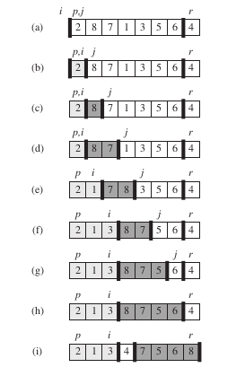

Quicksort è un algoritmo di ordinamento il cui tempo di esecuzione nel caso peggiore è Teta(n^2) con un array di input di n numeri. Nonostante questo tempo di esecuzione nel caso peggiore sia molto alto, quicksort spesso è la soluzione pratica migliore per effettuare un ordinamento, perché mediamente è molto efficiente:
il suo tempo di esecuzione atteso è Teta(n lg n) e i fattori costanti nascosti nella notazione Teta(n lg n/) sono molto piccoli.

Utilizza la tecnica Divide-et-Impera per ordinare un generico array che va da *p* ad *r*. 

Divide : partizionare l'array *A[p...r] in due sottoarray *A[p...q-1] e A[q+1...r]* e in cui ogni elemento del primo array, sia mino o uguale ad *A[q]* che a sua volta è minore ad ogni elemento di *A[q+1..r]*.

Impera: ordinare i due sottoarray A[p...q-1] e A[q+1...r] chiamando ricorsivamente quicksort.

Combina: poiché i sottoarray sono già ordinati, non occerre altro lavoro per ordinarli e quindi A[p...r] è ordinato.

L'elemento chiave dell'algoritmo è la procedura PARTITIOn che riarrangia il sottoarray A[p...r] sul posto

